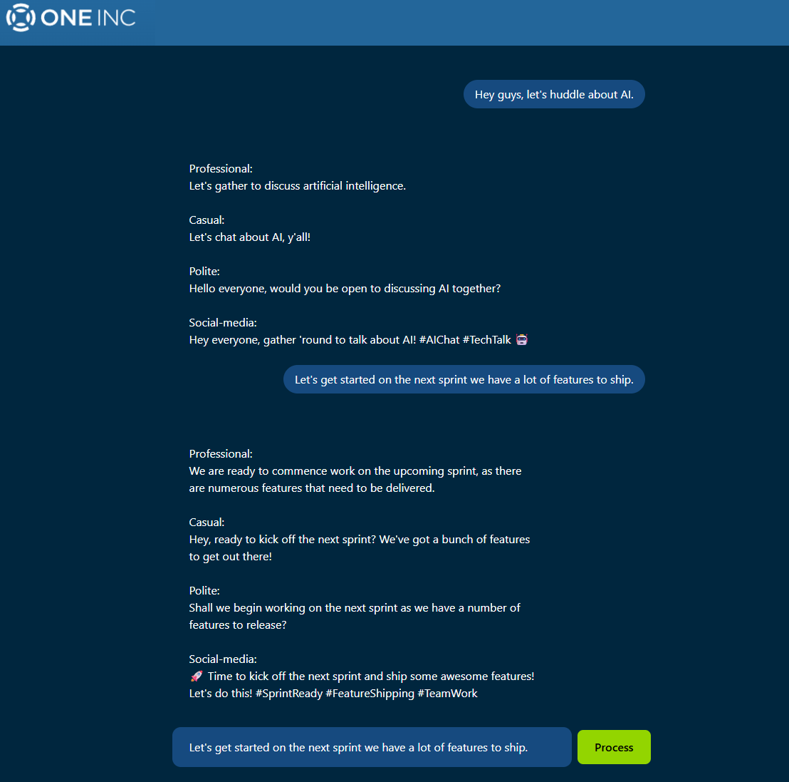

# One Inc Demo - AI Writing Assistant



A full-stack AI-powered writing assistant application with a containerized backend and modern frontend.

## 📋 Prerequisites

- Docker installed on your system
- Node.js and npm
- Valid OpenAI API key
- Python 3.x (for local testing)

## 🚀 Getting Started

### Clone the Repository

```bash
git clone https://github.com/jackwillis517/one-inc-demo.git
cd one-inc-demo
```

> **Note:** Both backend and frontend must be running simultaneously for the application to function properly.

## 🔧 Backend Setup

The backend is containerized with Docker and runs on **port 5000**.

### Prerequisites
- Create a `.env` file in the `backend` folder with your OpenAI API key:

```bash
cd backend
```

Create `.env` file:
```
OPENAI_API_KEY=your_openai_api_key_here
```

### Running the Backend

```bash
# Build the Docker image
docker build -t one-inc-demo-backend .

# Run the container
docker run -p 5000:5000 --env-file .env one-inc-demo-backend
```

### Testing the Backend

Backend tests use **pytest** and are run locally (not in Docker).

```bash
# Install development dependencies
pip install -r requirements-dev.txt

# Run tests
pytest -v
```

## 🎨 Frontend Setup

The frontend runs on **port 5173**.

### Installation and Setup

```bash
cd frontend/one-inc-demo
npm install
```

### Running the Frontend

```bash
npm run dev
```

The application will be available at `http://localhost:5173`

### Testing the Frontend

Frontend tests use **vitest** with **happy-dom**.

```bash
npm run test
```

## 📊 Port Configuration

| Service  | Port |
|----------|------|
| Backend  | 5000 |
| Frontend | 5173 |

## 🧪 Testing Overview

- **Backend Tests**: pytest 
- **Frontend Tests**: vitest + happy-dom

## 🐳 Architecture

- **Backend**: Dockerized Flask application
- **Frontend**: React.js application using Vite 
- **Testing**: Local test execution for both components

---

Make sure both services are running before testing the full application functionality.

